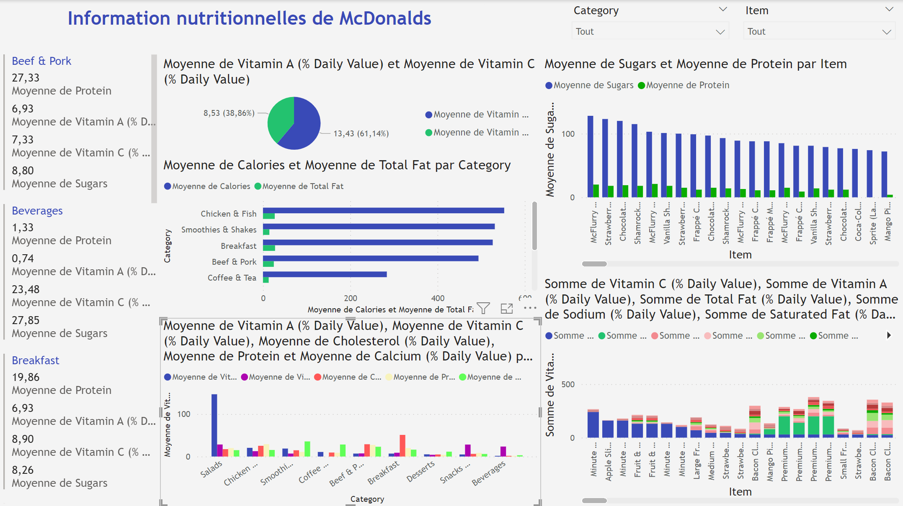

# McDonald's BI Dashboard — Power BI

TP de Business Intelligence visant à visualiser la **composition nutritionnelle** des produits du menu McDonald's à l'aide de Power BI.

## Objectif du TP

Visualiser la composition de chaque élément et de chaque catégorie de repas chez McDonald's (calories, protéines, sucres, glucides, vitamines...) afin d'en tirer des enseignements nutritionnels.

## Technologies utilisées

- **Power BI** — visualisation et création de dashboard interactif
- Données nutritionnelles McDonald's (déjà nettoyées à l'import)

## Visualisations réalisées

- **Clustered column chart** : moyenne des sucres et des protéines par élément du menu
- **Clustered column chart** : moyenne de chaque ingrédient par catégorie
- **Stacked column chart** : somme des ingrédients par élément
- **Carte multi-lignes** : consommation moyenne des vitamines A et C par plat
- **Clustered bar chart** : moyenne des calories et glucides par catégorie
- **Carte multi-lignes** : protéines, vitamines A et C par catégorie

Toutes ces visualisations ont ensuite été assemblées en un dashboard unique.

## Aperçu du dashboard final

## 📝 Note

Ce TP fait partie d'un ensemble de travaux pratiques Business Intelligence (Power Pivot, Talend, SSIS, Power BI) réalisés dans le cadre du cursus Ingénierie des Systèmes d'Information et Big Data. Ce README se concentre spécifiquement sur le TP **Power BI — Information nutritionnelle McDonald's**.
